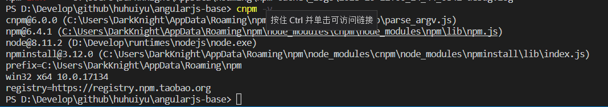
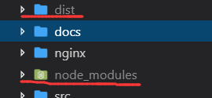
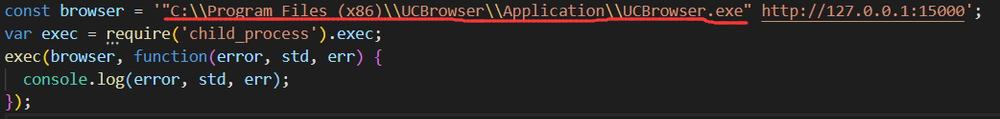
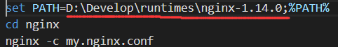
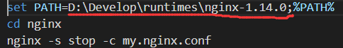
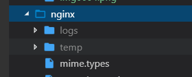

# 开发说明文档

## 环境检查

- nodejs 是否安装，在控制台执行`node -v`查看 nodejs 是否安装，正确会显示版本号，必须大于等于 8
- cnpm 是否安装，在控制台执行`cnpm -v`查看 cnpm 是否安装，正确会显示类似下图效果

- gulp 是否安装，在控制台执行`gulp -v`查看 gulp 是否安装，正确会显示版本号
- 这里要添加安装 node 和 cnpm 的文档链接

## 项目初始化

- 初始化仅需要执行一次
- 控制台中执行`cnpm install`安装项目依赖
- 在控制台执行`gulp`初始化项目打包
- 上面执行成功，项目中会出现`node_modules`和`dist`文件夹

- 配置文件路径修改

  - 修改[browser.js](../browser.js)中浏览器执行文件的路径，如图

  

  - 修改[nginx-start.bat](../nginx-start.bat)中的 nginx 所在路径

  

  - 修改[nginx-stop.bat](../nginx-stop.bat)中的 nginx 所在路径

  

  - 在[nginx](../nginx)目录中创建`temp`和`logs`目录

  

- 脚本文件说明
  - [nginx-start.bat](../nginx-start.bat)是 nginx 服务启动脚本
  - [nginx-stop.bat](../nginx-stop.bat)是 nginx 服务关闭脚本
  - [browser.js](../browser.js)是浏览器启动的 nodejs 指令
  - [browser.bat](../browser.bat)是浏览器启动脚本
  - [gulpfile.js](../gulpfile.js)是开发相关的 gulp 配置指令
  - [dev.bat](../dev.bat)是启动项目开发文件检测和打包脚本
  - [rundev.bat](../rundev.bat)是按照次序启动`nginx-start.bat`,`browser.bat`,`dev.bat`

## 开发说明

- 开发目录说明
  - [src](../src)是源代码目录
    - [html](../src/html)是项目`html文件`目录
      - [templates](../src/html/templates)是项目`html模板`目录
    - [css](../src/css)是项目`css文件`目录
    - [js](../src/js)是项目`js文件`目录
      - [controllers](../src/js/controllers)是项目`js控制器`目录
      - [directives](../src/js/directives)是项目`js指令`目录
      - [services](../src/js/services)是项目`js服务`目录
    - [images](../src/images)是项目`媒体文件`目录
    - `css`,`js`,`images`,`templates`中的`test`目录都不会出现在项目发布目录里面，仅限于开发测试中临时使用
  - [nginx](../nginx)是`nginx`配置目录
    - [temp](../nginx/temp)是 nginx 运行临时文件目录(被 git 忽略)
    - [logs](../nginx/logs)是 nginx 运行日志文件目录(被 git 忽略)
  - [node_modules](../node_modules)是`nodejs`的模块目录(被 git 忽略)
  - [dist](../dist)是项目打包后的目录，也是`nginx`的 web 根目录(被 git 忽略)
- 开发执行脚本说明
  - 控制台中执行`.\rundev.bat`启动 nginx 服务并进入开发模式
  - 控制台按`ctrl+C`后输入`y`中断开发模式，然后执行`.\nginx-stop.bat`停止 nginx 服务
  - 如果开发模式因为其它原因中断只需要在控制台中执行`.\dev.bat`即可重新开启
  - 如果浏览器关闭了在控制台中执行`.\browser.bat`即可重新开启
  - 如果 nginx 服务关闭了在控制台中执行`.\nginx-start.bat`即可重新开启
- 开发步骤说明
  - 在[html 模板-templates 目录](../src/html/templates)中创建模块目录，如果是顶级文件，可以省略
